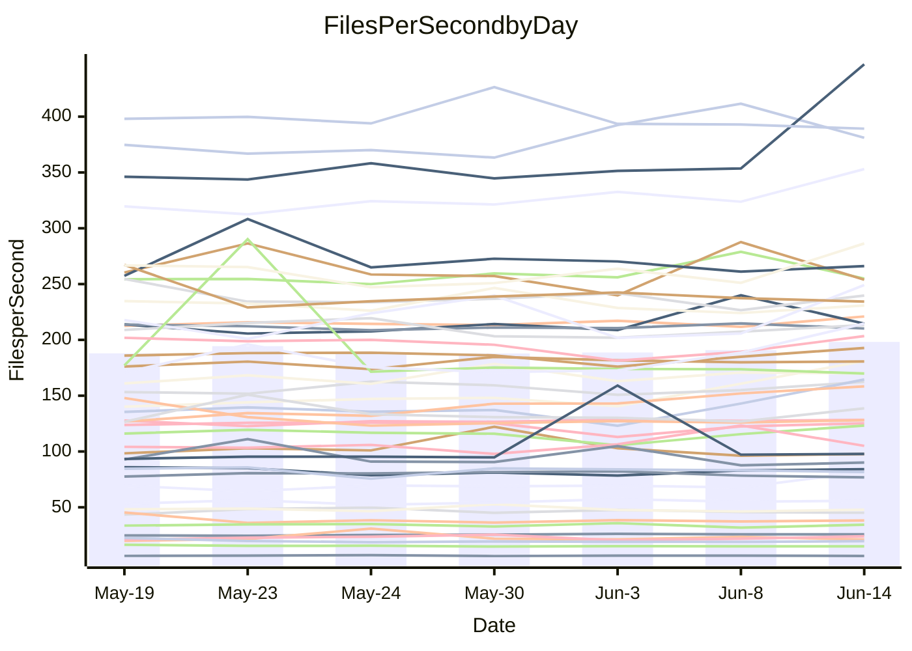

<!---
# This file is auto-generated. Do not edit.
# cspell:disable
--->
# Performance Report

Daily Performance

Time to Process Files

| Repository                                      | Elapsed | Min/Avg/Max          |   SD | SD Graph                |
| ----------------------------------------------- | ------: | :------------------: | ---: | ----------------------- |
| AdaDoom3/AdaDoom3                    |    2.78 | 2.2 /   2.7 /   2.9  | 0.19 | `    ┣━━┻━━╋●━┻━━┫    ` |
| alexiosc/megistos                    |    7.13 | 6.7 /   7.1 /   7.9  | 0.33 | `    ┣━━┻━━╋●━┻━━┫    ` |
| apollographql/apollo-server          |    2.67 | 1.4 /   2.5 /   2.8  | 0.29 | `    ┣━━┻━━╋━●┻━━┫    ` |
| aspnetboilerplate/aspnetboilerplate  |    9.18 | 7.3 /   8.8 /   9.3  | 0.44 | `    ┣━━┻━━╋━━●━━┫    ` |
| aws-amplify/docs                     |   12.54 | 10.1 /  12.4 /  13.4 | 0.66 | `    ┣━━┻━━╋●━┻━━┫    ` |
| Azure/azure-rest-api-specs           |    8.41 | 7.6 /   9.7 /  10.8  | 0.77 | `    ┣●━┻━━╋━━┻━━┫    ` |
| bitjson/typescript-starter           |    1.04 | 0.8 /   1.0 /   1.1  | 0.07 | `     ┣━┻━━╋●━┻━┫     ` |
| caddyserver/caddy                    |    3.36 | 2.7 /   3.4 /   3.7  | 0.27 | `    ┣━━┻━━●━━┻━━┫    ` |
| canada-ca/open-source-logiciel-libre |    1.20 | 0.9 /   1.1 /   1.2  | 0.07 | `     ┣━┻━━╋━━┻━●     ` |
| chef/chef                            |    4.82 | 4.6 /   4.9 /   5.3  | 0.19 | `    ┣━━┻●━╋━━┻━━┫    ` |
| dart-lang/sdk                        |   55.55 | 55.5 /  58.4 /  70.0 | 3.45 | `  ┣━━━┻●━━╋━━━┻━━━┫  ` |
| django/django                        |   13.77 | 10.4 /  13.5 /  14.2 | 0.86 | `    ┣━━┻━━╋●━┻━━┫    ` |
| eslint/eslint                        |    9.59 | 9.5 /   9.8 /  10.3  | 0.22 | `    ┣━━●━━╋━━┻━━┫    ` |
| exonum/exonum                        |    3.32 | 3.3 /   3.4 /   3.7  | 0.11 | `     ┣━┻●━╋━━┻━┫     ` |
| flutter/samples                      |   11.32 | 9.0 /  12.0 /  13.6  | 1.11 | `    ┣━━┻●━╋━━┻━━┫    ` |
| gitbucket/gitbucket                  |    3.14 | 2.5 /   3.1 /   3.4  | 0.26 | `    ┣━━┻━━●━━┻━━┫    ` |
| googleapis/google-cloud-cpp          |   70.73 | 95.0 / 118.7 / 126.5 | 9.13 | `●     ┣━┻━╋━┻━┫      ` |
| graphql/express-graphql              |    1.07 | 0.9 /   1.1 /   1.3  | 0.11 | `     ┣━┻●━╋━━┻━┫     ` |
| graphql/graphql-js                   |    3.56 | 2.6 /   2.9 /   3.6  | 0.29 | `    ┣━━┻━━╋━━┻━━┫●   ` |
| graphql/graphql-relay-js             |    1.10 | 1.0 /   1.1 /   1.2  | 0.04 | `     ┣━┻━━●━━┻━┫     ` |
| graphql/graphql-spec                 |    1.26 | 1.0 /   1.2 /   1.4  | 0.07 | `     ┣━┻━━●━━┻━┫     ` |
| iluwatar/java-design-patterns        |   12.27 | 7.1 /  11.6 /  12.3  | 1.22 | `   ┣━━━┻━━╋━●┻━━━┫   ` |
| ktaranov/sqlserver-kit               |    6.23 | 5.5 /   5.9 /   7.5  | 0.44 | `    ┣━━┻━━╋━●┻━━┫    ` |
| liriliri/licia                       |    3.86 | 3.0 /   3.8 /   4.1  | 0.26 | `    ┣━━┻━━╋●━┻━━┫    ` |
| MartinThoma/LaTeX-examples           |    6.19 | 4.7 /   6.1 /   6.5  | 0.38 | `    ┣━━┻━━╋●━┻━━┫    ` |
| mdx-js/mdx                           |    1.73 | 1.7 /   1.8 /   1.9  | 0.06 | `     ┣━┻━●╋━━┻━┫     ` |
| microsoft/TypeScript-Website         |    3.16 | 4.1 /   5.2 /   5.6  | 0.33 | `●      ┣┻━╋━┻┫       ` |
| MicrosoftDocs/PowerShell-Docs        |   23.41 | 23.0 /  24.7 /  26.4 | 0.86 | `   ┣━●━┻━━╋━━┻━━━┫   ` |
| neovim/nvim-lspconfig                |    5.12 | 4.0 /   5.1 /   5.6  | 0.33 | `    ┣━━┻━━●━━┻━━┫    ` |
| pagekit/pagekit                      |    3.24 | 3.3 /   3.5 /   3.6  | 0.08 | `  ●  ┣━┻━━╋━━┻━┫     ` |
| php/php-src                          |   24.19 | 14.4 /  23.3 /  25.6 | 2.40 | `   ┣━━┻━━━╋●━━┻━━┫   ` |
| plasticrake/tplink-smarthome-api     |    1.25 | 1.0 /   1.3 /   1.4  | 0.09 | `     ┣━┻━●╋━━┻━┫     ` |
| prettier/prettier                    |    4.26 | 7.3 /   7.7 /   8.3  | 0.23 | `●        ┣╋┫         ` |
| pycontribs/jira                      |    1.46 | 1.4 /   1.5 /   1.6  | 0.08 | `     ┣━┻━━●━━┻━┫     ` |
| RustPython/RustPython                |    6.69 | 6.4 /   6.7 /   7.4  | 0.26 | `    ┣━━┻━━●━━┻━━┫    ` |
| shoelace-style/shoelace              |    2.81 | 2.7 /   2.8 /   3.0  | 0.11 | `     ┣━┻━━●━━┻━┫     ` |
| slint-ui/slint                       |   13.51 | 11.3 /  13.5 /  14.5 | 0.70 | `    ┣━━┻━━●━━┻━━┫    ` |
| SoftwareBrothers/admin-bro           |    2.58 | 2.3 /   2.4 /   2.6  | 0.10 | `     ┣━┻━━╋━━┻●┫     ` |
| sveltejs/svelte                      |   22.67 | 17.1 /  22.0 /  23.2 | 1.35 | `   ┣━━━┻━━╋━●┻━━━┫   ` |
| TheAlgorithms/Python                 |    5.55 | 4.1 /   5.3 /   5.9  | 0.46 | `    ┣━━┻━━╋●━┻━━┫    ` |
| twbs/bootstrap                       |    1.36 | 1.3 /   1.7 /   1.9  | 0.12 | `  ●  ┣━┻━━╋━━┻━┫     ` |
| typescript-cheatsheets/react         |    1.12 | 0.7 /   1.1 /   1.3  | 0.14 | `     ┣━┻━━╋●━┻━┫     ` |
| typescript-eslint/typescript-eslint  |    4.03 | 3.1 /   4.1 /   4.6  | 0.29 | `    ┣━━┻━━●━━┻━━┫    ` |
| vitest-dev/vitest                    |    9.76 | 7.7 /  10.0 /  10.7  | 0.66 | `    ┣━━┻━●╋━━┻━━┫    ` |
| w3c/aria-practices                   |    3.21 | 2.5 /   3.2 /   3.4  | 0.21 | `    ┣━━┻━━●━━┻━━┫    ` |
| w3c/specberus                        |    1.85 | 1.2 /   1.9 /   2.2  | 0.21 | `     ┣━┻━━●━━┻━┫     ` |
| webdeveric/webpack-assets-manifest   |    1.15 | 1.0 /   1.2 /   1.4  | 0.08 | `     ┣━┻●━╋━━┻━┫     ` |
| webpack/webpack                      |    4.42 | 4.2 /   5.3 /   5.9  | 0.46 | `    ●━━┻━━╋━━┻━━┫    ` |
| wireapp/wire-desktop                 |    1.35 | 1.2 /   1.3 /   1.6  | 0.09 | `     ┣━┻━━●━━┻━┫     ` |
| wireapp/wire-webapp                  |   11.74 | 11.5 /  12.0 /  12.7 | 0.28 | `    ┣━━●━━╋━━┻━━┫    ` |

Note:
- Elapsed time is in seconds.

Files per Second over Time

| Repository                                      | Files |   Sec |    Fps |     Rel | Trend Fps           |    N |
| ----------------------------------------------- | ----: | ----: | -----: | ------: | ------------------- | ---: |
| AdaDoom3/AdaDoom3                    |   103 |  2.78 |  37.11 |  -3.14% | `▇█▃▃▅▃▃▂▃▃▄▃▄▃▄▄▃` |   16 |
| alexiosc/megistos                    |   583 |  7.13 |  81.71 |  -1.15% | `█▇█▆▇▃▆▇▄▆▅▆▇▇█▇▆` |   16 |
| apollographql/apollo-server          |   255 |  2.67 |  95.38 |  -9.30% | `▂▂▂▂▂▂▂█▂▂▂▁▂▂▂▂▂` |   16 |
| aspnetboilerplate/aspnetboilerplate  |  2286 |  9.18 | 248.96 |  -4.36% | `▃▄▃▃▃▃▃▄▄▄▃▄█▄▄▃▃` |   16 |
| aws-amplify/docs                     |  2959 | 12.54 | 235.98 |  -1.63% | `▄█▄▂▄▃▄▄▃▄▄▄▃▄▃▄▃` |   16 |
| Azure/azure-rest-api-specs           |  2482 |  8.41 | 295.24 |  14.03% | `▄▄▄▄▂▄▂▅▃▃▄▂▃▄▂█▆` |   16 |
| bitjson/typescript-starter           |    20 |  1.04 |  19.15 |  -2.96% | `█▄▄▄▄▂▄▃▄▃▃▂▃▄▃▅▃` |   16 |
| caddyserver/caddy                    |   314 |  3.36 |  93.37 |  -0.17% | `▄▄▆█▃▃▃▄▂▃▆▃▃▃▂▃▄` |   16 |
| canada-ca/open-source-logiciel-libre |     7 |  1.20 |   5.86 | -11.82% | `▃▆▆▄█▅▂▅▃▆▅▅▅▆▅▅▂` |   16 |
| chef/chef                            |  1032 |  4.82 | 214.18 |   2.30% | `▆▆█▆▇█▅▄▄▇▅▇▅▅▅█▇` |   16 |
| dart-lang/sdk                        | 11472 | 55.55 | 206.52 |   5.35% | `▇█▇▇▇█▇▆▇▇▅▇▃█▇██` |   16 |
| django/django                        |  2922 | 13.77 | 212.24 |  -2.18% | `▃▃▂▂▂▂▃▂▃▃▂▃▃█▃▃▃` |   16 |
| eslint/eslint                        |  2080 |  9.59 | 216.79 |   2.56% | `█▆▇▇▇▆█▇▅▇▇█▇█▅▆█` |   16 |
| exonum/exonum                        |   421 |  3.32 | 126.65 |   2.26% | `▆▇▇▇█▇▇█▇▇▄▇▇▅▇▇▇` |   16 |
| flutter/samples                      |  1695 | 11.32 | 149.72 |   4.96% | `▂▂▃▂▃▂▄▃▄▂▄▄▄▅█▃▄` |   16 |
| gitbucket/gitbucket                  |   417 |  3.14 | 132.69 |  -0.76% | `▃▂█▃▄▃▃▃▃▄▃▃▃▂▂▇▃` |   16 |
| googleapis/google-cloud-cpp          | 21266 | 70.73 | 300.66 |  68.79% | `▁▂▄▂▂▂▁▂▁▂▂▁▂▄▂▁█` |   16 |
| graphql/express-graphql              |    26 |  1.07 |  24.41 |   5.44% | `▃▂▃▄▄▄▄█▄▅▂▂▂▅▄▅▄` |   16 |
| graphql/graphql-js                   |   547 |  3.56 | 153.75 |   8.79% | `▃▂▃▃▃▂▂▃▃▃▂▃▂▅▄█▅` |   16 |
| graphql/graphql-relay-js             |    28 |  1.10 |  25.54 |   0.45% | `▄▅▄▅▄▇▅▆▆▅▆▆▄█▆▆▆` |   16 |
| graphql/graphql-spec                 |    19 |  1.26 |  15.12 |  -1.02% | `▃█▄▄▄▄▃▂▄▄▄▄▃▄▃▃▄` |   16 |
| iluwatar/java-design-patterns        |  2089 | 12.27 | 170.27 |  -6.19% | `▂▂█▁▂▂▂▂▂▂▂▂▁▁▁▁`  |   15 |
| ktaranov/sqlserver-kit               |   490 |  6.23 |  78.64 |  -5.44% | `▇▇▇▇▂▇▅███▇▆▆▇▇▆▅` |   16 |
| liriliri/licia                       |  1438 |  3.86 | 372.47 |  -1.90% | `▃▄▂▄▃▃▃▂▃▄▄█▃▄▃▄▃` |   16 |
| MartinThoma/LaTeX-examples           |  1409 |  6.19 | 227.69 |  -2.55% | `▃▄▃▃▃▂█▃▃▃▃▂▂▃▃▃▃` |   16 |
| mdx-js/mdx                           |   139 |  1.73 |  80.28 |   1.09% | `▄█▆█▇▇█▇█▇█▆▆▆▅▄▇` |   16 |
| microsoft/TypeScript-Website         |   765 |  3.16 | 242.30 |  63.02% | `▂▁▂▂▂▃▂▂▂▂▂▂▅▂▂▂█` |   16 |
| MicrosoftDocs/PowerShell-Docs        |  3126 | 23.41 | 133.56 |   5.56% | `▅▇▄▅▇▅▄▆▇▅▆█▆▄▅▆▇` |   16 |
| neovim/nvim-lspconfig                |   861 |  5.12 | 168.25 |  -0.69% | `▃▃▃▃▂▃▃█▄▃▃▄▄▃▄▄▃` |   16 |
| pagekit/pagekit                      |   741 |  3.24 | 229.04 |   7.00% | `▄▆▅▇▅▆▄▄▇▆▆▆▄▅▅▇█` |   16 |
| php/php-src                          |  2295 | 24.19 |  94.86 |  -4.94% | `▁▂▂▂▂▂▂▂▂▂█▂▂▂▂▃▂` |   16 |
| plasticrake/tplink-smarthome-api     |    62 |  1.25 |  49.49 |   1.64% | `▄▄▄▄▄▂█▅▅▄▄▃▄▂▃▄▄` |   16 |
| prettier/prettier                    |  2712 |  4.26 | 637.01 |  82.32% | `▂▂▂▂▂▂▂▂▂▁▂▂▂▂▂▂█` |   16 |
| pycontribs/jira                      |    80 |  1.46 |  54.94 |   0.41% | `▄▇▇▇▅▅▇▅█▃█▄█▇█▇▆` |   16 |
| RustPython/RustPython                |   810 |  6.69 | 121.00 |   3.58% | `▆▆█▆▆▆▅▆▅▇▃▄▅███▇` |   16 |
| shoelace-style/shoelace              |   440 |  2.81 | 156.50 |  -0.59% | `▇▄▄▆█▇▇▇▇▆▅▇▅▆██▆` |   16 |
| slint-ui/slint                       |  3318 | 13.51 | 245.65 |   3.77% | `█▃▃▄▄▄▃▄▄▅▅▃▃▃▄▄▅` |   16 |
| SoftwareBrothers/admin-bro           |   441 |  2.58 | 171.14 |  -5.32% | `▆▄▇▅▅▅▇█▇▄▆▆▆▅▇▇▄` |   16 |
| sveltejs/svelte                      |  8893 | 22.67 | 392.22 |  -2.51% | `▃▃▃▃▃▂▃█▃▃▃▃▂▃▃▂▃` |   16 |
| TheAlgorithms/Python                 |  1411 |  5.55 | 254.35 |  -4.24% | `▄▃▂▇▃▄▃▃▃▃▂█▃▃▃▃▃` |   16 |
| twbs/bootstrap                       |   118 |  1.36 |  86.92 |  25.01% | `▄▄▂▃▄▄▄▄▄▃▄▄▃▃▃██` |   16 |
| typescript-cheatsheets/react         |    24 |  1.12 |  21.37 |  -6.55% | `▂▁▂▂█▄▃▂▂▂▂▂▂▅▂▂▂` |   16 |
| typescript-eslint/typescript-eslint  |  1321 |  4.03 | 327.93 |   0.27% | `▃▄▂▄▃▄▃▄▄▃▄▃▃▄▃█▄` |   16 |
| vitest-dev/vitest                    |  2708 |  9.76 | 277.42 |   2.59% | `▂▂▃█▃▃▄▄▃▃▃▃▃▂▃▂▄` |   16 |
| w3c/aria-practices                   |   414 |  3.21 | 128.95 |  -0.10% | `▃█▃▃▂▃▃▂▃▂▃▃▃▃▃▃▃` |   16 |
| w3c/specberus                        |   196 |  1.85 | 106.06 |  -0.42% | `▃▂▂▃▃▃▃▂▁▂▃█▂▃▃▂▃` |   16 |
| webdeveric/webpack-assets-manifest   |    55 |  1.15 |  47.69 |   3.68% | `▅▂▅▆█▅▅▄▄▄▅▅▅▄▃▅▅` |   16 |
| webpack/webpack                      |  1199 |  4.42 | 271.42 |  21.99% | `▃▄▂▄▄▄█▄▄▂▂▃▃▇▃▇`  |   15 |
| wireapp/wire-desktop                 |    44 |  1.35 |  32.70 |  -2.93% | `█▅▇██▇█▆▇▃█▆▃▆██▆` |   16 |
| wireapp/wire-webapp                  |  2241 | 11.74 | 190.92 |   2.24% | `▇▆▆▇▇▆▆▆▆▆▄▅▇▆▇█▇` |   16 |

Data Throughput

| Repository                                      | Files |   Sec |     Kps |     Rel | Trend Kps           |    N |
| ----------------------------------------------- | ----: | ----: | ------: | ------: | ------------------- | ---: |
| AdaDoom3/AdaDoom3                    |   103 |  2.78 |  788.74 |  -3.14% | `▇█▃▃▅▃▃▂▃▃▄▃▄▃▄▄▃` |   16 |
| alexiosc/megistos                    |   583 |  7.13 |  642.07 |  -1.15% | `█▇█▆▇▃▆▇▄▆▅▆▇▇█▇▆` |   16 |
| apollographql/apollo-server          |   255 |  2.67 |  788.11 |  -9.30% | `▂▂▂▂▂▂▂█▂▂▂▁▂▂▂▂▂` |   16 |
| aspnetboilerplate/aspnetboilerplate  |  2286 |  9.18 |  605.74 |  -4.36% | `▃▄▃▃▃▃▃▄▄▄▃▄█▄▄▃▃` |   16 |
| aws-amplify/docs                     |  2959 | 12.54 |  853.33 |  -1.63% | `▄█▄▂▄▃▄▄▃▄▄▄▃▄▃▄▃` |   16 |
| Azure/azure-rest-api-specs           |  2482 |  8.41 |  898.93 |  15.57% | `▄▄▄▄▂▄▂▅▃▃▄▂▃▄▃█▆` |   16 |
| bitjson/typescript-starter           |    20 |  1.04 |   76.60 |  -2.96% | `█▄▄▄▄▂▄▃▄▃▃▂▃▄▃▅▃` |   16 |
| caddyserver/caddy                    |   314 |  3.36 |  844.46 |   0.80% | `▄▄▆█▃▃▃▄▂▃▆▃▃▃▂▄▄` |   16 |
| canada-ca/open-source-logiciel-libre |     7 |  1.20 |   48.53 | -11.82% | `▃▆▆▄█▅▂▅▃▆▅▅▅▆▅▅▂` |   16 |
| chef/chef                            |  1032 |  4.82 | 1050.54 |   2.45% | `▆▆█▆▇█▅▄▄▇▅▇▅▅▅█▇` |   16 |
| dart-lang/sdk                        | 11472 | 55.55 | 1409.52 |   5.23% | `▇██▇▇█▇▆▇▇▅█▃█▇██` |   16 |
| django/django                        |  2922 | 13.77 | 1361.18 |  -2.17% | `▃▃▂▂▂▂▃▂▃▃▂▃▃█▃▃▃` |   16 |
| eslint/eslint                        |  2080 |  9.59 | 1508.50 |   2.58% | `█▆▇▇▇▆█▇▅▇▇█▇█▅▆█` |   16 |
| exonum/exonum                        |   421 |  3.32 | 1211.47 |   2.26% | `▆▇▇▇█▇▇█▇▇▄▇▇▅▇▇▇` |   16 |
| flutter/samples                      |  1695 | 11.32 |  896.09 |   4.96% | `▂▂▃▂▃▂▄▃▄▂▄▄▄▅█▃▄` |   16 |
| gitbucket/gitbucket                  |   417 |  3.14 |  632.89 |  -0.72% | `▃▂█▃▄▃▃▃▃▄▃▃▃▂▂▇▃` |   16 |
| googleapis/google-cloud-cpp          | 21266 | 70.73 | 2590.66 |  70.08% | `▁▂▄▂▂▂▁▂▁▂▂▁▂▄▂▁█` |   16 |
| graphql/express-graphql              |    26 |  1.07 |  111.72 |   5.44% | `▃▂▃▄▄▄▄█▄▅▂▂▂▅▄▅▄` |   16 |
| graphql/graphql-js                   |   547 |  3.56 | 1135.82 |  28.67% | `▂▂▂▂▂▂▂▂▂▂▁▂▂▆▅█▅` |   16 |
| graphql/graphql-relay-js             |    28 |  1.10 |  100.35 |   0.45% | `▄▅▄▅▄▇▅▆▆▅▆▆▄█▆▆▆` |   16 |
| graphql/graphql-spec                 |    19 |  1.26 |  506.14 |  -0.77% | `▃█▄▄▄▄▃▂▄▄▄▄▃▄▃▄▄` |   16 |
| iluwatar/java-design-patterns        |  2089 | 12.27 |  524.59 |  -6.23% | `▂▂█▂▂▂▂▂▂▂▂▂▁▁▁▁`  |   15 |
| ktaranov/sqlserver-kit               |   490 |  6.23 | 1191.39 |  -5.44% | `▇▇▇▇▂▇▅███▇▆▆▇▇▆▅` |   16 |
| liriliri/licia                       |  1438 |  3.86 |  444.47 |  -1.90% | `▃▄▂▄▃▃▃▂▃▄▄█▃▄▃▄▃` |   16 |
| MartinThoma/LaTeX-examples           |  1409 |  6.19 |  470.24 |  -2.55% | `▃▄▃▃▃▂█▃▃▃▃▂▂▃▃▃▃` |   16 |
| mdx-js/mdx                           |   139 |  1.73 |  375.40 |   1.05% | `▄█▆█▇▇█▇█▇█▆▆▆▅▄▇` |   16 |
| microsoft/TypeScript-Website         |   765 |  3.16 | 1668.83 |  63.02% | `▂▁▂▂▂▃▂▂▂▂▂▂▅▂▂▂█` |   16 |
| MicrosoftDocs/PowerShell-Docs        |  3126 | 23.41 | 1423.51 |   5.58% | `▅▇▄▅▇▅▄▆▇▅▆█▆▄▅▆▇` |   16 |
| neovim/nvim-lspconfig                |   861 |  5.12 |  493.21 |  -0.69% | `▃▃▃▃▂▃▃█▄▃▃▄▄▃▄▄▃` |   16 |
| pagekit/pagekit                      |   741 |  3.24 |  477.56 |   7.00% | `▄▆▅▇▅▆▄▄▇▆▆▆▄▅▅▇█` |   16 |
| php/php-src                          |  2295 | 24.19 | 1669.80 |  -4.88% | `▁▂▂▂▂▂▂▂▂▂█▂▂▂▂▃▂` |   16 |
| plasticrake/tplink-smarthome-api     |    62 |  1.25 |  267.38 |   1.64% | `▄▄▄▄▄▂█▅▅▄▄▃▄▂▃▄▄` |   16 |
| prettier/prettier                    |  2712 |  4.26 |  870.01 |  81.51% | `▂▂▂▂▂▂▂▂▂▁▂▂▂▂▂▂█` |   16 |
| pycontribs/jira                      |    80 |  1.46 |  388.02 |   0.41% | `▄▇▇▇▅▅▇▅█▃█▄█▇█▇▆` |   16 |
| RustPython/RustPython                |   810 |  6.69 | 1958.35 |  -0.59% | `▆▆█▆▆▇▆▆▅█▃▄▆▇▇▇▆` |   16 |
| shoelace-style/shoelace              |   440 |  2.81 |  755.83 |  -0.59% | `▇▄▄▆█▇▇▇▇▆▅▇▅▆██▆` |   16 |
| slint-ui/slint                       |  3318 | 13.51 | 1293.35 |   4.45% | `█▃▃▄▄▄▃▄▄▅▅▃▃▃▄▄▅` |   16 |
| SoftwareBrothers/admin-bro           |   441 |  2.58 |  377.20 |  -5.32% | `▆▄▇▅▅▅▇█▇▄▆▆▆▅▇▇▄` |   16 |
| sveltejs/svelte                      |  8893 | 22.67 |  267.80 |  -2.01% | `▃▃▃▃▃▂▃█▃▃▃▃▂▃▃▃▃` |   16 |
| TheAlgorithms/Python                 |  1411 |  5.55 |  650.20 |  -4.16% | `▄▃▂▇▃▄▃▃▃▃▂█▃▄▃▃▃` |   16 |
| twbs/bootstrap                       |   118 |  1.36 |  713.01 |  24.91% | `▄▄▂▃▄▄▄▄▄▃▄▄▃▃▃██` |   16 |
| typescript-cheatsheets/react         |    24 |  1.12 |  193.19 |  -6.20% | `▂▁▂▂█▄▃▂▂▂▂▂▂▅▂▂▂` |   16 |
| typescript-eslint/typescript-eslint  |  1321 |  4.03 | 1788.33 |   0.86% | `▃▄▂▄▃▄▃▄▄▃▄▃▃▄▃█▄` |   16 |
| vitest-dev/vitest                    |  2708 |  9.76 |  732.79 |   4.37% | `▂▂▃█▃▃▃▄▃▃▃▃▃▂▃▃▄` |   16 |
| w3c/aria-practices                   |   414 |  3.21 | 1204.74 |  -0.10% | `▃█▃▃▂▃▃▂▃▂▃▃▃▃▃▃▃` |   16 |
| w3c/specberus                        |   196 |  1.85 |  345.79 |  -0.42% | `▃▂▂▃▃▃▃▂▁▂▃█▂▃▃▂▃` |   16 |
| webdeveric/webpack-assets-manifest   |    55 |  1.15 |  109.25 |   3.68% | `▅▂▅▆█▅▅▄▄▄▅▅▅▄▃▅▅` |   16 |
| webpack/webpack                      |  1199 |  4.42 | 1446.97 |  27.66% | `▃▃▂▄▃▄█▄▄▂▂▃▄█▄█`  |   15 |
| wireapp/wire-desktop                 |    44 |  1.35 |  147.17 |  -1.16% | `█▅▆█▇▇▇▆▆▃█▆▃▇██▆` |   16 |
| wireapp/wire-webapp                  |  2241 | 11.74 |  792.20 |   1.67% | `▇▆▇▇▇▇▆▇▇▇▄▅▇▆▇█▇` |   16 |

