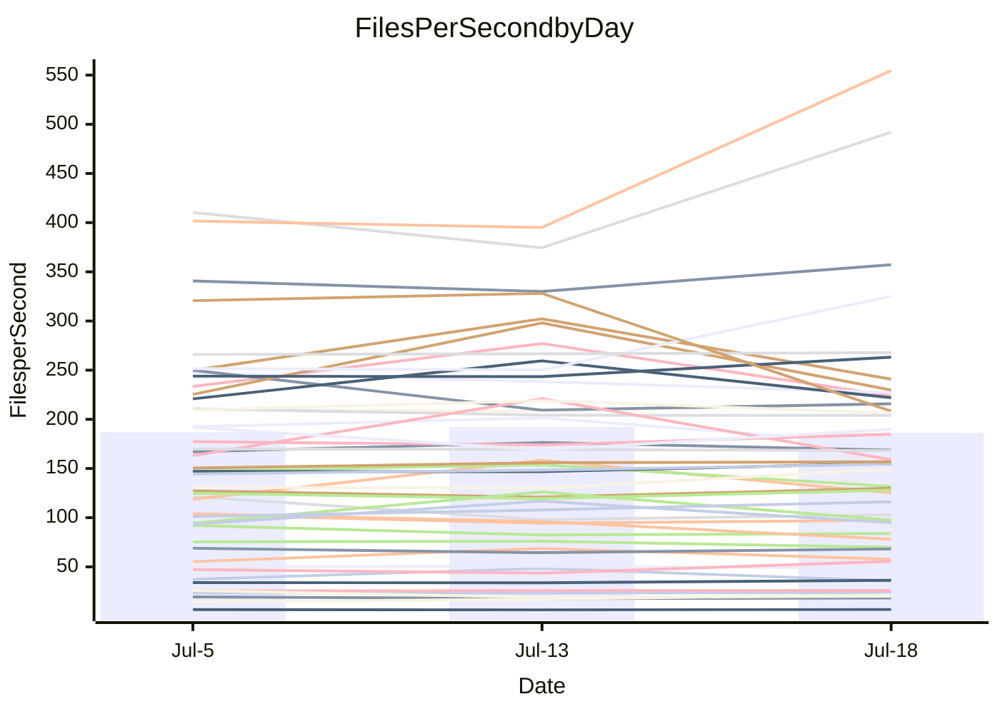

<!---
# This file is auto-generated. Do not edit.
# cspell:disable
--->
# Performance Report

Daily Performance

```mermaid
xychart-beta
    title Files Per Second by Day
    y-axis Files per Second
    x-axis Date [Jul-5, Jul-13, Jul-18]
    bar [186.85, 192.31, 186.27]
    line [19.46, 17.82, 18.28]
    line [102.97, 94.47, 97.30]
    line [121.46, 97.93, 102.99]
    line [92.06, 82.41, 83.83]
    line [249.74, 302.24, 240.91]
    line [37.33, 48.47, 35.83]
    line [233.42, 277.07, 223.82]
    line [6.57, 6.29, 6.65]
    line [209.98, 208.19, 215.64]
    line [247.09, 238.39, 227.23]
    line [249.94, 209.39, 215.89]
    line [118.72, 158.48, 125.02]
    line [210.72, 204.20, 204.01]
    line [147.25, 153.81, 131.72]
    line [127.24, 120.84, 130.01]
    line [23.61, 23.34, 23.76]
    line [25.58, 25.88, 26.03]
    line [147.06, 146.76, 155.27]
    line [14.44, 17.18, 21.53]
    line [192.47, 201.45, 174.85]
    line [166.99, 176.39, 168.69]
    line [104.04, 96.02, 78.05]
    line [410.40, 374.43, 492.02]
    line [75.44, 76.00, 69.83]
    line [225.39, 298.01, 229.77]
    line [144.57, 148.29, 154.45]
    line [163.07, 221.06, 158.85]
    line [220.82, 259.46, 222.04]
    line [130.91, 129.95, 149.48]
    line [50.17, 50.42, 48.90]
    line [340.70, 330.04, 357.19]
    line [55.28, 68.71, 57.76]
    line [169.94, 169.41, 168.07]
    line [94.49, 126.09, 97.43]
    line [150.47, 155.87, 156.79]
    line [93.33, 116.87, 94.85]
    line [177.29, 174.01, 184.83]
    line [243.88, 243.47, 263.15]
    line [26.00, 18.90, 20.23]
    line [251.57, 250.26, 325.23]
    line [68.91, 64.41, 68.17]
    line [401.72, 395.07, 554.62]
    line [266.02, 266.63, 267.72]
    line [124.96, 119.39, 127.92]
    line [320.66, 328.06, 208.29]
    line [101.09, 107.84, 116.24]
    line [47.14, 43.65, 55.60]
    line [33.94, 33.78, 36.29]
    line [209.38, 218.96, 206.44]
    line [191.84, 169.05, 189.86]
```

Time to Process Files

| Repository                                      | Elapsed | Min/Avg/Max           |   SD | SD Graph                |
| ----------------------------------------------- | ------: | :-------------------: | ---: | ----------------------- |
| AdaDoom3/AdaDoom3                    |    2.87 | 2.1 /   2.6 /   2.8   | 0.28 | `    ┣━━┻━━╋━━●━━┫    ` |
| alexiosc/megistos                    |    6.95 | 5.3 /   6.6 /   7.1   | 0.74 | `   ┣━━━┻━━╋━●┻━━━┫   ` |
| apollographql/apollo-server          |    2.49 | 1.5 /   2.3 /   2.6   | 0.45 | `    ┣━━┻━━╋●━┻━━┫    ` |
| aspnetboilerplate/aspnetboilerplate  |    9.50 | 7.6 /   8.8 /   9.3   | 0.71 | `   ┣━━━┻━━╋━━┻●━━┫   ` |
| aws-amplify/docs                     |   13.25 | 10.7 /  12.2 /  13.3  | 0.94 | `   ┣━━┻━━━╋━━━●━━┫   ` |
| Azure/azure-rest-api-specs           |   11.10 | 9.9 /  10.2 /  10.4   | 0.25 | `    ┣━━┻━━╋━━┻━━┫   ●` |
| bitjson/typescript-starter           |    1.09 | 0.9 /   1.1 /   1.3   | 0.16 | `    ┣━━┻━━●━━┻━━┫    ` |
| caddyserver/caddy                    |    3.31 | 2.7 /   3.2 /   3.4   | 0.32 | `    ┣━━┻━━╋●━┻━━┫    ` |
| canada-ca/open-source-logiciel-libre |    1.05 | 1.0 /   1.1 /   1.1   | 0.03 | `     ┣━●━━╋━━┻━┫     ` |
| chef/chef                            |    4.79 | 4.9 /   4.9 /   5.0   | 0.02 | `●      ┣┻━╋━┻┫       ` |
| dart-lang/sdk                        |   65.91 | 57.0 /  59.1 /  63.1  | 2.33 | `   ┣━━┻━━━╋━━━┻━━┫  ●` |
| django/django                        |   13.57 | 8.6 /  12.8 /  14.6   | 2.42 | `  ┣━━━┻━━━╋●━━┻━━━┫  ` |
| eslint/eslint                        |   10.20 | 9.6 /  10.0 /  10.2   | 0.22 | `   ┣━━━┻━━╋━━┻●━━┫   ` |
| exonum/exonum                        |    3.37 | 2.7 /   3.3 /   3.7   | 0.39 | `    ┣━━┻━━●━━┻━━┫    ` |
| flutter/samples                      |   12.88 | 11.0 /  11.4 /  11.6  | 0.22 | `       ┣┻━╋━┻┫      ●` |
| gitbucket/gitbucket                  |    3.21 | 3.2 /   3.3 /   3.5   | 0.08 | `    ┣━●┻━━╋━━┻━━┫    ` |
| googleapis/google-cloud-cpp          |  125.68 | 124.3 / 125.5 / 126.1 | 0.72 | `  ┣━━━┻━━━╋●━━┻━━━┫  ` |
| graphql/express-graphql              |    1.09 | 1.1 /   1.1 /   1.2   | 0.03 | `     ┣━┻━●╋━━┻━┫     ` |
| graphql/graphql-js                   |    3.54 | 3.6 /   3.7 /   3.9   | 0.10 | `    ●━━┻━━╋━━┻━━┫    ` |
| graphql/graphql-relay-js             |    1.08 | 1.1 /   1.1 /   1.1   | 0.02 | `     ┣━┻●━╋━━┻━┫     ` |
| graphql/graphql-spec                 |    0.88 | 1.1 /   1.3 /   1.3   | 0.10 | `●    ┣━┻━━╋━━┻━┫     ` |
| iluwatar/java-design-patterns        |   12.38 | 11.8 /  12.3 /  12.6  | 0.30 | `   ┣━━━┻━━●━━┻━━━┫   ` |
| ktaranov/sqlserver-kit               |    6.28 | 3.5 /   5.0 /   5.8   | 0.88 | `   ┣━━━┻━━╋━━┻━●━┫   ` |
| liriliri/licia                       |    2.92 | 3.0 /   3.6 /   3.8   | 0.35 | `    ●━━┻━━╋━━┻━━┫    ` |
| MartinThoma/LaTeX-examples           |    6.13 | 4.7 /   5.9 /   6.4   | 0.68 | `   ┣━━━┻━━╋●━┻━━━┫   ` |
| mdx-js/mdx                           |    1.99 | 1.8 /   1.8 /   1.9   | 0.03 | `      ┣━┻━╋━┻━┫     ●` |
| microsoft/TypeScript-Website         |    4.95 | 5.2 /   5.3 /   5.5   | 0.13 | `   ●┣━━┻━━╋━━┻━━┫    ` |
| MicrosoftDocs/PowerShell-Docs        |   20.91 | 23.5 /  23.9 /  24.6  | 0.41 | `●      ┣━┻╋┻━┫       ` |
| neovim/nvim-lspconfig                |    5.46 | 3.9 /   4.9 /   5.5   | 0.61 | `   ┣━━━┻━━╋━━●━━━┫   ` |
| pagekit/pagekit                      |    3.34 | 2.9 /   3.2 /   3.4   | 0.22 | `    ┣━━┻━━╋━●┻━━┫    ` |
| php/php-src                          |   23.73 | 18.3 /  22.9 /  24.8  | 2.69 | `  ┣━━━┻━━━╋●━━┻━━━┫  ` |
| plasticrake/tplink-smarthome-api     |    1.27 | 1.0 /   1.3 /   1.5   | 0.15 | `    ┣━━┻━━●━━┻━━┫    ` |
| prettier/prettier                    |    7.40 | 7.4 /   7.8 /   8.1   | 0.24 | `   ┣━●━┻━━╋━━┻━━━┫   ` |
| pycontribs/jira                      |    1.38 | 1.2 /   1.4 /   1.6   | 0.15 | `    ┣━━┻━━●━━┻━━┫    ` |
| RustPython/RustPython                |    9.00 | 7.1 /   8.4 /   8.9   | 0.78 | `   ┣━━━┻━━╋━━●━━━┫   ` |
| shoelace-style/shoelace              |    2.81 | 2.8 /   2.9 /   3.0   | 0.05 | `    ┣●━┻━━╋━━┻━━┫    ` |
| slint-ui/slint                       |   13.21 | 13.8 /  14.0 /  14.2  | 0.15 | `●     ┣━┻━╋━┻━┫      ` |
| SoftwareBrothers/admin-bro           |    2.39 | 2.4 /   2.5 /   2.7   | 0.10 | `    ┣━━●━━╋━━┻━━┫    ` |
| sveltejs/svelte                      |   16.07 | 21.7 /  22.3 /  22.5  | 0.31 | `●        ┣╋┫         ` |
| TheAlgorithms/Python                 |    4.34 | 5.4 /   5.6 /   5.8   | 0.16 | `●      ┣━┻╋┻━┫       ` |
| twbs/bootstrap                       |    1.73 | 1.7 /   1.7 /   1.8   | 0.05 | `    ┣━━┻━●╋━━┻━━┫    ` |
| typescript-cheatsheets/react         |    1.19 | 0.7 /   1.0 /   1.3   | 0.22 | `    ┣━━┻━━╋━●┻━━┫    ` |
| typescript-eslint/typescript-eslint  |    4.15 | 3.9 /   4.1 /   4.3   | 0.16 | `    ┣━━┻━━╋●━┻━━┫    ` |
| vitest-dev/vitest                    |   10.18 | 10.1 /  10.3 /  10.5  | 0.17 | `    ┣━━┻●━╋━━┻━━┫    ` |
| w3c/aria-practices                   |    3.26 | 3.2 /   3.4 /   3.5   | 0.14 | `    ┣━━●━━╋━━┻━━┫    ` |
| w3c/specberus                        |    1.63 | 1.8 /   1.9 /   2.1   | 0.13 | `    ●━━┻━━╋━━┻━━┫    ` |
| webdeveric/webpack-assets-manifest   |    0.99 | 1.1 /   1.2 /   1.3   | 0.04 | `●     ┣━┻━╋━┻━┫      ` |
| webpack/webpack                      |    6.04 | 5.6 /   5.8 /   6.1   | 0.15 | `    ┣━━┻━━╋━━┻●━┫    ` |
| wireapp/wire-desktop                 |    1.35 | 1.3 /   1.3 /   1.4   | 0.05 | `    ┣━━┻━━╋━━●━━┫    ` |
| wireapp/wire-webapp                  |   12.75 | 11.9 /  12.6 /  13.9  | 0.74 | `   ┣━━┻━━━╋●━━┻━━┫   ` |

Note:
- Elapsed time is in seconds.

Files per Second over Time

| Repository                                      | Files |    Sec |    Fps |     Rel | Trend Fps |    N |
| ----------------------------------------------- | ----: | -----: | -----: | ------: | --------- | ---: |
| AdaDoom3/AdaDoom3                    |   103 |   2.87 |  35.83 | -10.69% | `▃▃▂█▂`   |    4 |
| alexiosc/megistos                    |   583 |   6.95 |  83.83 |  -6.49% | `█▂▃▂▃`   |    4 |
| apollographql/apollo-server          |   256 |   2.49 | 102.99 | -10.89% | `█▁▂▂▂`   |    4 |
| aspnetboilerplate/aspnetboilerplate  |  2288 |   9.50 | 240.91 |  -8.35% | `▃▃▄█▂`   |    4 |
| aws-amplify/docs                     |  2965 |  13.25 | 223.82 |  -8.40% | `▃▄▄█▃`   |    4 |
| Azure/azure-rest-api-specs           |  2522 |  11.10 | 227.23 |  -7.22% | `██▆▅▃`   |    4 |
| bitjson/typescript-starter           |    20 |   1.09 |  18.28 |  -4.06% | `█▅▂▄▄`   |    4 |
| caddyserver/caddy                    |   322 |   3.31 |  97.30 |  -3.52% | `▂▃█▃▃`   |    4 |
| canada-ca/open-source-logiciel-libre |     7 |   1.05 |   6.65 |   2.34% | `█▆█▅█`   |    4 |
| chef/chef                            |  1034 |   4.79 | 215.64 |   2.91% | `▇▆▇▆█`   |    4 |
| dart-lang/sdk                        | 11524 |  65.91 | 174.85 | -10.20% | `▄▇▇█▃`   |    4 |
| django/django                        |  2929 |  13.57 | 215.89 |  -9.97% | `▂▁█▂▂`   |    4 |
| eslint/eslint                        |  2080 |  10.20 | 204.01 |  -2.43% | `█▇▆▅▅`   |    4 |
| exonum/exonum                        |   421 |   3.37 | 125.02 |  -2.83% | `▃▂▃█▃`   |    4 |
| flutter/samples                      |  1696 |  12.88 | 131.72 | -11.53% | `▆▆▆█ `   |    4 |
| gitbucket/gitbucket                  |   417 |   3.21 | 130.01 |   3.48% | `▇█▇▅█`   |    4 |
| googleapis/google-cloud-cpp          | 21123 | 125.68 | 168.07 |  -1.02% | `▇█▇▇▇`   |    4 |
| graphql/express-graphql              |    26 |   1.09 |  23.76 |   0.93% | `▇▅█▆▇`   |    4 |
| graphql/graphql-js                   |   550 |   3.54 | 155.27 |   5.64% | `▆▄▇▆█`   |    4 |
| graphql/graphql-relay-js             |    28 |   1.08 |  26.03 |   1.48% | `█▆███`   |    4 |
| graphql/graphql-spec                 |    19 |   0.88 |  21.53 |  42.31% | `▂▂▂▄█`   |    4 |
| iluwatar/java-design-patterns        |  2089 |  12.38 | 168.69 |  -0.38% | `▅▆▆█▆`   |    4 |
| ktaranov/sqlserver-kit               |   490 |   6.28 |  78.05 | -23.50% | `▂█▂▃▁`   |    4 |
| liriliri/licia                       |  1438 |   2.92 | 492.02 |  22.57% | `▇▃▂▂█`   |    4 |
| MartinThoma/LaTeX-examples           |  1409 |   6.13 | 229.77 |  -5.66% | `▂▃▂█▃`   |    4 |
| mdx-js/mdx                           |   139 |   1.99 |  69.83 |  -7.61% | `▆▇█▇▃`   |    4 |
| microsoft/TypeScript-Website         |   765 |   4.95 | 154.45 |   6.15% | `▄▆▆▆█`   |    4 |
| MicrosoftDocs/PowerShell-Docs        |  3126 |  20.91 | 149.48 |  14.40% | `▄▄▃▄█`   |    4 |
| neovim/nvim-lspconfig                |   867 |   5.46 | 158.85 | -10.54% | `▃▂▃█▂`   |    4 |
| pagekit/pagekit                      |   741 |   3.34 | 222.04 |  -3.66% | `▃▄▃█▄`   |    4 |
| php/php-src                          |  2312 |  23.73 |  97.43 |  -4.84% | `▃▂▂█▃`   |    4 |
| plasticrake/tplink-smarthome-api     |    62 |   1.27 |  48.90 |  -2.66% | `▂█▄▅▄`   |    4 |
| prettier/prettier                    |  2645 |   7.40 | 357.19 |   5.67% | `▆█▄▅█`   |    4 |
| pycontribs/jira                      |    80 |   1.38 |  57.76 |  -1.49% | `▄▂▄█▄`   |    4 |
| RustPython/RustPython                |   854 |   9.00 |  94.85 |  -4.41% | `▃▃▃█▃`   |    4 |
| shoelace-style/shoelace              |   440 |   2.81 | 156.79 |   3.27% | `▆▅▆██`   |    4 |
| slint-ui/slint                       |  3475 |  13.21 | 263.15 |   7.94% | `▅▅▄▅█`   |    4 |
| SoftwareBrothers/admin-bro           |   441 |   2.39 | 184.83 |   4.74% | `█▇▄▆█`   |    4 |
| sveltejs/svelte                      |  8913 |  16.07 | 554.62 |  38.64% | `▃▂▂▂█`   |    4 |
| TheAlgorithms/Python                 |  1411 |   4.34 | 325.23 |  29.45% | `▄▂▃▃█`   |    4 |
| twbs/bootstrap                       |   118 |   1.73 |  68.17 |   0.56% | `███▅▇`   |    4 |
| typescript-cheatsheets/react         |    24 |   1.19 |  20.23 | -16.47% | `▂▂█▁▂`   |    4 |
| typescript-eslint/typescript-eslint  |   865 |   4.15 | 208.29 | -35.42% | `▅█▄▇ `   |    4 |
| vitest-dev/vitest                    |  2725 |  10.18 | 267.72 |   0.58% | `▆▇█▇▇`   |    4 |
| w3c/aria-practices                   |   417 |   3.26 | 127.92 |   3.52% | `█▄█▅█`   |    4 |
| w3c/specberus                        |   190 |   1.63 | 116.24 |  13.10% | `▆▆▃▆█`   |    4 |
| webdeveric/webpack-assets-manifest   |    55 |   0.99 |  55.60 |  20.16% | `▄▄▅▃█`   |    4 |
| webpack/webpack                      |  1247 |   6.04 | 206.44 |  -2.52% | `▇▇▅█▅`   |    4 |
| wireapp/wire-desktop                 |    49 |   1.35 |  36.29 |   7.06% | `▇▆▄▆█`   |    4 |
| wireapp/wire-webapp                  |  2421 |  12.75 | 189.86 |   2.00% | `██▆▃▇`   |    4 |

Data Throughput

| Repository                                      | Files |    Sec |     Kps |     Rel | Trend Kps |    N |
| ----------------------------------------------- | ----: | -----: | ------: | ------: | --------- | ---: |
| AdaDoom3/AdaDoom3                    |   103 |   2.87 |  761.44 | -10.69% | `▃▃▂█▂`   |    4 |
| alexiosc/megistos                    |   583 |   6.95 |  658.68 |  -6.49% | `█▂▃▂▃`   |    4 |
| apollographql/apollo-server          |   256 |   2.49 |  848.07 | -11.20% | `█▁▂▂▂`   |    4 |
| aspnetboilerplate/aspnetboilerplate  |  2288 |   9.50 |  588.90 |  -8.35% | `▃▃▄█▂`   |    4 |
| aws-amplify/docs                     |  2965 |  13.25 |  809.97 |  -8.32% | `▃▄▄█▃`   |    4 |
| Azure/azure-rest-api-specs           |  2522 |  11.10 |  693.32 |  -7.44% | `██▆▅▃`   |    4 |
| bitjson/typescript-starter           |    20 |   1.09 |   73.11 |  -4.06% | `█▅▂▄▄`   |    4 |
| caddyserver/caddy                    |   322 |   3.31 |  885.65 |  -3.06% | `▂▃█▃▃`   |    4 |
| canada-ca/open-source-logiciel-libre |     7 |   1.05 |   55.12 |   2.34% | `█▆█▅█`   |    4 |
| chef/chef                            |  1034 |   4.79 | 1058.60 |   2.92% | `▇▆▇▆█`   |    4 |
| dart-lang/sdk                        | 11524 |  65.91 | 1194.14 | -10.19% | `▄▇▇█▃`   |    4 |
| django/django                        |  2929 |  13.57 | 1385.99 |  -9.98% | `▂▁█▂▂`   |    4 |
| eslint/eslint                        |  2080 |  10.20 | 1428.77 |  -1.98% | `█▇▆▅▅`   |    4 |
| exonum/exonum                        |   421 |   3.37 | 1195.85 |  -2.83% | `▃▂▃█▃`   |    4 |
| flutter/samples                      |  1696 |  12.88 |  788.12 | -11.53% | `▆▆▆█ `   |    4 |
| gitbucket/gitbucket                  |   417 |   3.21 |  621.07 |   3.48% | `▇█▇▅█`   |    4 |
| googleapis/google-cloud-cpp          | 21123 | 125.68 | 1459.13 |  -0.68% | `▇█▇▇▇`   |    4 |
| graphql/express-graphql              |    26 |   1.09 |  108.77 |   0.93% | `▇▅█▆▇`   |    4 |
| graphql/graphql-js                   |   550 |   3.54 | 1156.07 |   5.72% | `▆▄▇▆█`   |    4 |
| graphql/graphql-relay-js             |    28 |   1.08 |  102.27 |   1.48% | `█▆███`   |    4 |
| graphql/graphql-spec                 |    19 |   0.88 |  720.55 |  42.31% | `▂▂▂▄█`   |    4 |
| iluwatar/java-design-patterns        |  2089 |  12.38 |  519.88 |  -0.37% | `▅▆▆█▆`   |    4 |
| ktaranov/sqlserver-kit               |   490 |   6.28 | 1182.44 | -23.50% | `▂█▂▃▁`   |    4 |
| liriliri/licia                       |  1438 |   2.92 |  587.14 |  22.57% | `▇▃▂▂█`   |    4 |
| MartinThoma/LaTeX-examples           |  1409 |   6.13 |  474.54 |  -5.66% | `▂▃▂█▃`   |    4 |
| mdx-js/mdx                           |   139 |   1.99 |  329.06 |  -6.75% | `▆▇█▇▃`   |    4 |
| microsoft/TypeScript-Website         |   765 |   4.95 | 1064.80 |   6.15% | `▄▆▆▆█`   |    4 |
| MicrosoftDocs/PowerShell-Docs        |  3126 |  20.91 | 1594.95 |  14.49% | `▄▄▃▄█`   |    4 |
| neovim/nvim-lspconfig                |   867 |   5.46 |  465.37 | -10.50% | `▃▂▃█▂`   |    4 |
| pagekit/pagekit                      |   741 |   3.34 |  462.96 |  -3.66% | `▃▄▃█▄`   |    4 |
| php/php-src                          |  2312 |  23.73 | 1711.10 |  -4.83% | `▃▂▂█▃`   |    4 |
| plasticrake/tplink-smarthome-api     |    62 |   1.27 |  264.22 |  -2.66% | `▂█▄▅▄`   |    4 |
| prettier/prettier                    |  2645 |   7.40 |  507.23 |   5.48% | `▆█▄▅█`   |    4 |
| pycontribs/jira                      |    80 |   1.38 |  407.96 |  -1.49% | `▄▂▄█▄`   |    4 |
| RustPython/RustPython                |   854 |   9.00 | 2074.49 |  -6.14% | `▃▃▃█▃`   |    4 |
| shoelace-style/shoelace              |   440 |   2.81 |  757.21 |   3.27% | `▆▅▆██`   |    4 |
| slint-ui/slint                       |  3475 |  13.21 | 1393.35 |   8.64% | `▅▅▄▅█`   |    4 |
| SoftwareBrothers/admin-bro           |   441 |   2.39 |  407.39 |   4.74% | `█▇▄▆█`   |    4 |
| sveltejs/svelte                      |  8913 |  16.07 |  379.33 |  38.62% | `▃▂▂▂█`   |    4 |
| TheAlgorithms/Python                 |  1411 |   4.34 |  831.40 |  29.45% | `▄▂▃▃█`   |    4 |
| twbs/bootstrap                       |   118 |   1.73 |  559.19 |   0.56% | `███▅▇`   |    4 |
| typescript-cheatsheets/react         |    24 |   1.19 |  182.95 | -16.47% | `▂▂█▁▂`   |    4 |
| typescript-eslint/typescript-eslint  |   865 |   4.15 |  698.32 | -60.47% | `▅█▄▇ `   |    4 |
| vitest-dev/vitest                    |  2725 |  10.18 |  751.09 |   0.23% | `▆▇█▇▇`   |    4 |
| w3c/aria-practices                   |   417 |   3.26 | 1202.81 |   3.52% | `█▄█▅█`   |    4 |
| w3c/specberus                        |   190 |   1.63 |  379.93 |  13.39% | `▆▆▃▆█`   |    4 |
| webdeveric/webpack-assets-manifest   |    55 |   0.99 |  127.37 |  20.16% | `▄▄▅▃█`   |    4 |
| webpack/webpack                      |  1247 |   6.04 | 1163.48 |   1.96% | `▇▇▅█▇`   |    4 |
| wireapp/wire-desktop                 |    49 |   1.35 |  158.51 |   3.90% | `█▇▄▆█`   |    4 |
| wireapp/wire-webapp                  |  2421 |  12.75 |  785.15 |   1.87% | `██▆▃▇`   |    4 |

