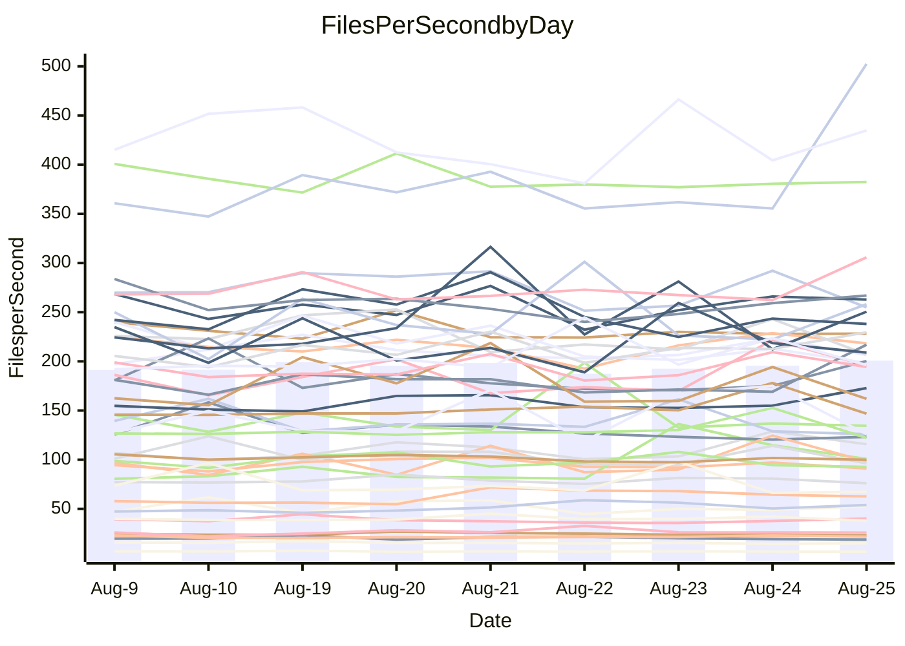

<!---
# This file is auto-generated. Do not edit.
# cspell:disable
--->
# Performance Report

Daily Performance

```mermaid
xychart-beta
    title Files Per Second by Day
    y-axis Files per Second
    x-axis Date [Aug-9, Aug-10, Aug-19, Aug-20, Aug-21, Aug-22, Aug-23, Aug-24, Aug-25]
    bar [191.27, 191.48, 199.45, 195.67, 198.22, 187.40, 192.61, 195.61, 200.74]
    line [19.76, 19.87, 23.15, 18.80, 21.30, 21.70, 20.11, 19.24, 18.73]
    line [94.45, 88.13, 97.66, 100.71, 101.93, 92.80, 92.11, 97.07, 91.05]
    line [106.66, 99.38, 103.80, 117.71, 112.47, 100.50, 103.30, 128.71, 115.73]
    line [80.61, 83.15, 92.81, 82.44, 81.86, 80.75, 136.22, 114.72, 100.78]
    line [239.79, 231.09, 223.10, 252.00, 224.60, 224.17, 230.06, 227.93, 228.22]
    line [269.81, 270.47, 289.77, 286.14, 291.59, 251.52, 256.69, 292.19, 254.88]
    line [39.52, 37.52, 44.46, 38.46, 37.42, 35.96, 35.65, 37.61, 40.09]
    line [268.54, 243.09, 257.77, 247.18, 276.72, 232.23, 252.08, 266.01, 262.87]
    line [6.78, 6.60, 7.51, 6.38, 6.72, 6.55, 6.77, 6.55, 6.43]
    line [240.17, 211.99, 227.00, 211.38, 205.51, 203.10, 206.43, 223.33, 206.40]
    line [125.68, 158.27, 127.25, 135.61, 133.76, 126.70, 123.28, 120.42, 123.27]
    line [225.24, 214.74, 210.02, 221.88, 213.58, 192.56, 216.27, 228.68, 218.26]
    line [225.91, 222.58, 246.74, 252.74, 209.47, 217.12, 212.13, 242.98, 207.05]
    line [145.75, 128.32, 148.05, 133.76, 130.09, 198.58, 132.66, 136.89, 134.47]
    line [24.65, 23.72, 23.68, 26.94, 25.51, 24.79, 23.76, 23.53, 22.92]
    line [139.45, 161.93, 128.87, 135.71, 136.66, 133.36, 161.38, 128.87, 126.03]
    line [25.95, 22.03, 24.86, 28.29, 26.21, 32.71, 26.20, 26.09, 25.87]
    line [154.75, 150.93, 149.02, 164.86, 165.64, 153.35, 152.64, 155.02, 172.80]
    line [15.80, 15.53, 17.25, 15.28, 15.49, 14.84, 15.46, 14.39, 15.01]
    line [196.97, 211.99, 246.59, 218.10, 236.31, 204.94, 201.38, 212.81, 198.46]
    line [180.75, 223.35, 172.94, 187.16, 177.68, 172.01, 170.49, 175.09, 200.35]
    line [96.93, 84.41, 106.12, 84.61, 114.12, 87.31, 89.99, 124.55, 98.16]
    line [77.16, 76.75, 77.91, 84.91, 78.76, 75.34, 81.46, 80.77, 76.05]
    line [400.74, 385.62, 371.65, 411.46, 377.61, 379.88, 377.18, 380.64, 382.42]
    line [145.79, 145.58, 147.10, 147.08, 151.07, 153.94, 150.27, 178.09, 146.72]
    line [249.96, 202.34, 263.67, 236.99, 228.06, 301.20, 226.40, 222.40, 258.13]
    line [186.27, 165.43, 184.07, 202.12, 167.51, 173.85, 169.85, 221.75, 196.04]
    line [224.37, 213.27, 217.89, 233.79, 316.48, 227.32, 281.23, 212.31, 250.53]
    line [47.00, 61.84, 45.89, 57.63, 58.67, 44.77, 49.92, 49.06, 52.40]
    line [127.47, 149.55, 129.16, 129.10, 170.99, 119.13, 167.47, 175.06, 126.06]
    line [181.18, 166.12, 186.93, 181.85, 181.88, 168.34, 171.35, 169.12, 216.93]
    line [57.90, 56.15, 56.35, 54.76, 71.89, 68.47, 68.09, 64.39, 62.63]
    line [101.07, 123.80, 99.87, 108.06, 107.98, 95.34, 94.96, 114.12, 96.33]
    line [98.84, 91.76, 103.43, 107.49, 93.08, 97.11, 107.90, 94.53, 92.62]
    line [162.48, 155.40, 204.32, 177.59, 218.64, 159.00, 159.79, 194.26, 161.90]
    line [360.76, 347.31, 389.41, 371.89, 392.82, 355.53, 361.83, 355.43, 502.53]
    line [198.91, 184.05, 187.41, 186.67, 207.48, 180.49, 185.92, 209.38, 194.30]
    line [242.10, 232.62, 273.32, 257.69, 290.62, 245.10, 224.83, 243.49, 238.04]
    line [73.60, 96.61, 68.89, 69.48, 73.38, 68.77, 97.84, 66.15, 67.47]
    line [415.14, 451.69, 458.22, 412.53, 400.53, 380.98, 466.37, 404.40, 434.80]
    line [283.77, 252.09, 262.36, 263.68, 253.37, 240.18, 248.22, 259.20, 266.91]
    line [22.84, 20.59, 20.47, 21.22, 20.90, 21.42, 21.40, 22.88, 21.71]
    line [205.56, 193.98, 216.67, 206.61, 230.20, 198.53, 213.69, 212.64, 229.54]
    line [126.64, 126.17, 128.45, 125.27, 127.94, 127.77, 130.20, 152.67, 122.08]
    line [105.46, 100.11, 102.43, 104.89, 103.21, 98.21, 97.36, 101.78, 99.90]
    line [47.26, 48.66, 46.00, 48.26, 51.42, 58.83, 56.30, 50.38, 53.91]
    line [268.09, 268.70, 290.78, 262.94, 266.60, 272.93, 267.45, 262.37, 305.79]
    line [234.76, 198.61, 243.75, 200.90, 213.71, 188.91, 259.37, 218.53, 208.94]
    line [39.98, 38.63, 38.64, 39.11, 45.24, 39.50, 39.66, 42.07, 37.98]
    line [192.03, 195.48, 194.87, 202.54, 193.62, 244.63, 196.70, 223.56, 196.25]
```

Time to Process Files

| Repository                                      | Elapsed | Min/Avg/Max          |    SD | SD Graph                |
| ----------------------------------------------- | ------: | :------------------: | ----: | ----------------------- |
| AdaDoom3/AdaDoom3                    |    2.27 | 2.1 /   2.7 /   3.0  |  0.25 | `    ┣●━┻━━╋━━┻━━┫    ` |
| alexiosc/megistos                    |    5.74 | 4.1 /   6.7 /   7.9  |  0.92 | `    ┣━━●━━╋━━┻━━┫    ` |
| apollographql/apollo-server          |    2.02 | 1.8 /   2.4 /   2.8  |  0.26 | `    ┣━●┻━━╋━━┻━━┫    ` |
| aspnetboilerplate/aspnetboilerplate  |    9.16 | 6.3 /   8.4 /   9.1  |  0.97 | `    ┣━━┻━━╋━━●━━┫    ` |
| aws-amplify/docs                     |   13.28 | 9.6 /  13.0 /  14.0  |  1.02 | `    ┣━━┻━━╋●━┻━━┫    ` |
| Azure/azure-rest-api-specs           |   10.65 | 7.2 /   9.9 /  11.2  |  0.93 | `    ┣━━┻━━╋━━●━━┫    ` |
| bitjson/typescript-starter           |    1.08 | 0.6 /   1.0 /   1.1  |  0.10 | `     ┣━┻━━╋━●┻━┫     ` |
| caddyserver/caddy                    |    3.79 | 2.5 /   3.5 /   3.9  |  0.35 | `    ┣━━┻━━╋━━●━━┫    ` |
| canada-ca/open-source-logiciel-libre |    1.11 | 0.8 /   1.0 /   1.3  |  0.10 | `     ┣━┻━━╋━●┻━┫     ` |
| chef/chef                            |    5.03 | 3.0 /   4.7 /   5.3  |  0.51 | `    ┣━━┻━━╋━●┻━━┫    ` |
| dart-lang/sdk                        |   59.08 | 34.3 /  55.3 /  64.6 |  7.04 | `  ┣━━━┻━━━╋━●━┻━━━┫  ` |
| django/django                        |   13.43 | 10.2 /  12.9 /  15.0 |  1.61 | `   ┣━━━┻━━╋●━┻━━━┫   ` |
| eslint/eslint                        |    9.64 | 7.6 /   9.6 /  10.8  |  0.75 | `    ┣━━┻━━●━━┻━━┫    ` |
| exonum/exonum                        |    3.38 | 2.6 /   3.3 /   3.7  |  0.26 | `    ┣━━┻━━╋●━┻━━┫    ` |
| flutter/samples                      |   12.60 | 8.0 /  12.2 /  14.0  |  1.39 | `    ┣━━┻━━╋●━┻━━┫    ` |
| gitbucket/gitbucket                  |    3.36 | 2.5 /   3.1 /   3.4  |  0.31 | `    ┣━━┻━━╋━━●━━┫    ` |
| googleapis/google-cloud-cpp          |   98.95 | 96.3 / 119.3 / 132.7 | 11.70 | `  ┣●━━┻━━━╋━━━┻━━━┫  ` |
| graphql/express-graphql              |    1.13 | 0.7 /   1.1 /   1.2  |  0.10 | `     ┣━┻━━╋━●┻━┫     ` |
| graphql/graphql-js                   |    3.67 | 2.8 /   3.5 /   3.9  |  0.29 | `    ┣━━┻━━╋━●┻━━┫    ` |
| graphql/graphql-relay-js             |    1.09 | 0.7 /   1.1 /   1.3  |  0.10 | `     ┣━┻━━●━━┻━┫     ` |
| graphql/graphql-spec                 |    1.27 | 0.8 /   1.2 /   1.4  |  0.13 | `     ┣━┻━━╋●━┻━┫     ` |
| iluwatar/java-design-patterns        |    9.60 | 8.8 /  12.0 /  12.8  |  1.05 | `   ●┣━━┻━━╋━━┻━━┫    ` |
| ktaranov/sqlserver-kit               |    5.69 | 3.1 /   5.1 /   6.2  |  0.97 | `    ┣━━┻━━╋━●┻━━┫    ` |
| liriliri/licia                       |    3.92 | 2.9 /   3.7 /   4.1  |  0.30 | `    ┣━━┻━━╋━●┻━━┫    ` |
| MartinThoma/LaTeX-examples           |    6.20 | 4.5 /   5.8 /   7.0  |  0.70 | `    ┣━━┻━━╋━●┻━━┫    ` |
| mdx-js/mdx                           |    1.80 | 1.5 /   1.8 /   1.9  |  0.09 | `     ┣━┻━━╋●━┻━┫     ` |
| microsoft/TypeScript-Website         |    5.41 | 3.7 /   5.1 /   5.6  |  0.36 | `    ┣━━┻━━╋━●┻━━┫    ` |
| MicrosoftDocs/PowerShell-Docs        |   24.70 | 13.9 /  23.0 /  26.2 |  3.27 | `   ┣━━┻━━━╋━●━┻━━┫   ` |
| neovim/nvim-lspconfig                |    3.88 | 3.7 /   4.7 /   5.6  |  0.59 | `    ┣━●┻━━╋━━┻━━┫    ` |
| pagekit/pagekit                      |    3.56 | 1.9 /   3.2 /   3.6  |  0.47 | `    ┣━━┻━━╋━●┻━━┫    ` |
| php/php-src                          |   25.20 | 18.2 /  23.1 /  26.1 |  2.51 | `   ┣━━━┻━━╋━━●━━━┫   ` |
| plasticrake/tplink-smarthome-api     |    1.32 | 0.8 /   1.2 /   1.4  |  0.16 | `     ┣━┻━━╋●━┻━┫     ` |
| prettier/prettier                    |    7.76 | 4.1 /   7.2 /   8.0  |  0.92 | `    ┣━━┻━━╋━●┻━━┫    ` |
| pycontribs/jira                      |    1.13 | 0.9 /   1.3 /   1.5  |  0.16 | `     ┣●┻━━╋━━┻━┫     ` |
| RustPython/RustPython                |    9.66 | 5.8 /   8.9 /  11.1  |  1.13 | `    ┣━━┻━━╋━●┻━━┫    ` |
| shoelace-style/shoelace              |    2.76 | 1.8 /   2.5 /   3.0  |  0.39 | `    ┣━━┻━━╋━●┻━━┫    ` |
| slint-ui/slint                       |   16.80 | 11.3 /  15.1 /  17.0 |  1.48 | `   ┣━━━┻━━╋━━┻●━━┫   ` |
| SoftwareBrothers/admin-bro           |    2.14 | 1.6 /   2.3 /   2.6  |  0.25 | `    ┣━━┻●━╋━━┻━━┫    ` |
| sveltejs/svelte                      |   19.34 | 16.9 /  21.5 /  23.5 |  1.85 | `   ┣━━●┻━━╋━━┻━━━┫   ` |
| TheAlgorithms/Python                 |    5.52 | 3.0 /   5.4 /   5.9  |  0.55 | `    ┣━━┻━━╋●━┻━━┫    ` |
| twbs/bootstrap                       |    1.81 | 1.2 /   1.6 /   1.9  |  0.18 | `     ┣━┻━━╋━●┻━┫     ` |
| typescript-cheatsheets/react         |    1.09 | 0.7 /   1.1 /   1.3  |  0.10 | `     ┣━┻━●╋━━┻━┫     ` |
| typescript-eslint/typescript-eslint  |    3.10 | 3.3 /   4.2 /   4.9  |  0.33 | ` ●  ┣━━┻━━╋━━┻━━┫    ` |
| vitest-dev/vitest                    |   10.49 | 8.1 /  10.2 /  10.8  |  0.75 | `    ┣━━┻━━╋●━┻━━┫    ` |
| w3c/aria-practices                   |    3.31 | 2.3 /   3.3 /   3.5  |  0.23 | `    ┣━━┻━━╋●━┻━━┫    ` |
| w3c/specberus                        |    1.90 | 1.5 /   1.9 /   2.2  |  0.14 | `     ┣━┻━━╋●━┻━┫     ` |
| webdeveric/webpack-assets-manifest   |    0.89 | 0.9 /   1.1 /   1.4  |  0.12 | `     ●━┻━━╋━━┻━┫     ` |
| webpack/webpack                      |    6.01 | 3.7 /   6.2 /   7.4  |  1.03 | `    ┣━━┻━━●━━┻━━┫    ` |
| wireapp/wire-desktop                 |    1.35 | 1.0 /   1.3 /   1.5  |  0.12 | `     ┣━┻━━╋━●┻━┫     ` |
| wireapp/wire-webapp                  |   13.03 | 10.3 /  12.7 /  14.2 |  0.96 | `    ┣━━┻━━╋●━┻━━┫    ` |

Note:
- Elapsed time is in seconds.

Files per Second over Time

| Repository                                      | Files |   Sec |    Fps |     Rel | Trend Fps              |    N |
| ----------------------------------------------- | ----: | ----: | -----: | ------: | ---------------------- | ---: |
| AdaDoom3/AdaDoom3                    |   103 |  2.27 |  45.35 |  16.51% | `▂▂▃▃▃█▇▃▃▆▃▃▃▃▂▂▃▃▂▇` |   23 |
| alexiosc/megistos                    |   583 |  5.74 | 101.64 |  14.17% | `▂▁▂▂▃▅▂▂▂▂▂▂▂▂▂██▃▄▄` |   23 |
| apollographql/apollo-server          |   256 |  2.02 | 126.57 |  14.98% | `▃▆▅▂▃▃▃█▃▅▃▃▆▃▃▃▆▆▃▆` |   23 |
| aspnetboilerplate/aspnetboilerplate  |  2288 |  9.16 | 249.73 | -10.26% | `▃▂▇▃█▂▂▃▂█▃▂█▂▂▂▂▆▂▂` |   23 |
| aws-amplify/docs                     |  3030 | 13.28 | 228.22 |  -2.90% | `▂▃▆▅▃▃▂▃▃▃█▃▂▂▃▂▃▃▂▃` |   22 |
| Azure/azure-rest-api-specs           |  2576 | 10.65 | 241.79 |  -7.55% | `▃▂▄▃▄▄▄▃▄▃▃▄█▄▂▄▆▃▆▃` |   23 |
| bitjson/typescript-starter           |    20 |  1.08 |  18.49 |  -8.72% | `▂▂▂▃█▂▃▂▁▂▂▂▃▄▃▃▂▂▂▂` |   23 |
| caddyserver/caddy                    |   338 |  3.79 |  89.27 |  -7.63% | `▆▄▂▂▂▅▃▃▂▃█▆▃▃▃▃▃▄▃▂` |   23 |
| canada-ca/open-source-logiciel-libre |     7 |  1.11 |   6.29 |  -6.81% | `▇▁▄▃█▄▃▂▄▄▃▃▄▃▃▄▃▃▃▃` |   23 |
| chef/chef                            |  1035 |  5.03 | 205.92 |  -7.12% | `▂▂█▂▂▂▄▂▂▂▂▂▂▂▂▂▂▃▂▂` |   23 |
| dart-lang/sdk                        | 11634 | 59.08 | 196.91 |  -8.39% | `▂▂▂▃▂█▂▅▂▂▂▂▇▂▂▂▂▃▂▂` |   23 |
| django/django                        |  2932 | 13.43 | 218.28 |  -5.18% | `▆▃█▄▇▃▅█▃█▅▃▂▃▃▃▂█▂▃` |   23 |
| eslint/eslint                        |  2082 |  9.64 | 216.05 |  -1.34% | `▄▃▄▅▄▅▄█▄▅▄▅▄▅▂▅▅▇▅▅` |   23 |
| exonum/exonum                        |   421 |  3.38 | 124.63 |  -3.68% | `▄▃▄█▃▄▄▄█▄▃▄▃▇▄▃▂▃▃▃` |   23 |
| flutter/samples                      |  1703 | 12.60 | 135.11 |  -4.59% | `█▃▂▂▂▄▄▂▂▂▂▁▂▂▇▂▃▂▂▂` |   23 |
| gitbucket/gitbucket                  |   418 |  3.36 | 124.44 |  -9.36% | `▃█▄█▂▃▅█▂▃▃▇▃▃▄█▃▃▃▃` |   23 |
| googleapis/google-cloud-cpp          | 21983 | 98.95 | 222.15 |  22.89% | `▃▃▃▂█▂▃▇▃▃▃▂▇▂▃▃▃▂▇█` |   23 |
| graphql/express-graphql              |    26 |  1.13 |  23.09 |  -6.83% | `▂▂▃▃▃▂▂▃▃▃█▅▃▃▃▃▂▃▂▂` |   23 |
| graphql/graphql-js                   |   551 |  3.67 | 150.09 |  -5.40% | `▃▇▃▃▃▃▃█▃▃▄▄▇▄▃▃▃▄█▃` |   23 |
| graphql/graphql-relay-js             |    28 |  1.09 |  25.74 |  -2.51% | `▃▅▂▁▃▃▃▃▃█▃▃▃▃▆▃▃▃▃▃` |   23 |
| graphql/graphql-spec                 |    19 |  1.27 |  15.00 |  -4.02% | `▃▂▂▃█▂▃▃▃▃▃▃▄▃▃▃▃▂▃▃` |   23 |
| iluwatar/java-design-patterns        |  2183 |  9.60 | 227.48 |  25.93% | `▂▄█▇▂▃▃▃▃▄▆▃▃▃▃▂▃▃▃▇` |   23 |
| ktaranov/sqlserver-kit               |   490 |  5.69 |  86.09 | -13.86% | `▁▄▂▂▂▇▂▁▂▂▂▃▂█▂▂▄▇▄▂` |   23 |
| liriliri/licia                       |  1442 |  3.92 | 367.92 |  -5.97% | `█▇▄▃▃▃▃▃█▄▄▃▃▃▃▃▃▃▄▃` |   23 |
| MartinThoma/LaTeX-examples           |  1409 |  6.20 | 227.19 |  -7.29% | `█▄▃▂▄█▆▃▃▆▃▃▃▄█▃▃▃▇▃` |   23 |
| mdx-js/mdx                           |   139 |  1.80 |  77.13 |  -2.52% | `▃▅▃▄▅▅▃▅▆█▇▅▄▅▄▅▅▅▃▄` |   23 |
| microsoft/TypeScript-Website         |   765 |  5.41 | 141.37 |  -6.06% | `▂▃▃▃▃▂▃▃▂▃▃▃▃▃▃▃▃█▃▂` |   23 |
| MicrosoftDocs/PowerShell-Docs        |  3126 | 24.70 | 126.54 |  -9.64% | `▂▂▂▃▂▂▂▂▂▂▂█▄▂▁▄▂█▂▂` |   23 |
| neovim/nvim-lspconfig                |   871 |  3.88 | 224.34 |  20.34% | `▆▃▅▃▃▆▄▆▆█▃▃▃▃▃▃▇▇▃▇` |   23 |
| pagekit/pagekit                      |   741 |  3.56 | 207.96 | -13.79% | `▁▄▂▂▂▂▂▅▂▁▂▆█▂▂▄▁▂▅▁` |   23 |
| php/php-src                          |  2389 | 25.20 |  94.81 |  -9.27% | `▃▇▃▇▃▅▂▃▇▃▅█▃▂▃▂▃█▃▂` |   23 |
| plasticrake/tplink-smarthome-api     |    62 |  1.32 |  46.90 |  -9.03% | `▂▁▂▅▁▂▂▅▃▂▇▂▃█▂▃▂▃▄▂` |   23 |
| prettier/prettier                    |  2699 |  7.76 | 347.93 |  -8.98% | `▁▁▂▂▂▄▂▃▁▂▁▄▂▂▂▂▂▂█▂` |   23 |
| pycontribs/jira                      |    80 |  1.13 |  70.50 |  16.57% | `▂▂▂▂▂▂▂▂▂▂▂█▂▅▄▄▂▅▂▅` |   22 |
| RustPython/RustPython                |   877 |  9.66 |  90.77 |  -8.90% | `▃▆▅▃▃▃▅▃▃█▃▂▃▃▃▄▃▃▃▂` |   23 |
| shoelace-style/shoelace              |   440 |  2.76 | 159.35 | -11.55% | `▅▂▂▂▂█▆▂▂▂▇▇▇▄▂▂▇▂▃▂` |   23 |
| slint-ui/slint                       |  3875 | 16.80 | 230.71 |  -9.33% | `▃▃▃▂▃█▃▂▃▇▃▆█▃▃▂▃▃▃▂` |   23 |
| SoftwareBrothers/admin-bro           |   441 |  2.14 | 205.94 |   5.83% | `▃▃▃▃▃▃▃▅▂▂▂▂▃█▂▃▂▇▃▄` |   23 |
| sveltejs/svelte                      |  9020 | 19.34 | 466.42 |  11.24% | `▃▃█▅█▅▂▅▂▃▃▃▂▃▂▆▃▃▃▆` |   23 |
| TheAlgorithms/Python                 |  1411 |  5.52 | 255.64 |  -4.01% | `▂█▂▂▂▂▂▂▂▂▂▁▂▂▁▂▂▂▂▂` |   23 |
| twbs/bootstrap                       |   118 |  1.81 |  65.34 | -10.81% | `▃▂▆█▃▃▃▃▃▄▃▅▃▂▃█▃▂▃▂` |   23 |
| typescript-cheatsheets/react         |    24 |  1.09 |  22.06 |   1.57% | `▆▅▇▄▅▅▃▅▄▅▆▄▅▅▅▅█▆▅▆` |   23 |
| typescript-eslint/typescript-eslint  |   869 |  3.10 | 280.01 |  33.71% | `▄▄▄▃▄▄▄▄▄▂▄▇▄▄▃▄▄▄▂█` |   23 |
| vitest-dev/vitest                    |  2790 | 10.49 | 266.00 |  -2.58% | `▂▂▆▃▃█▃▃▂▃▂▃▃▃▃▃▂▃█▃` |   23 |
| w3c/aria-practices                   |   417 |  3.31 | 125.82 |  -2.38% | `▂▃▃▃▃▃▃▂▂▃▂▃▃▂▃▃█▂▂▂` |   23 |
| w3c/specberus                        |   190 |  1.90 |  99.80 |  -3.31% | `▄▄▅▄▄▅▅▂█▄▆▅▄▅▄▄▄▅▄▄` |   23 |
| webdeveric/webpack-assets-manifest   |    55 |  0.89 |  61.86 |  26.27% | `▃▃▅▄▄▃▃▄█▃▂█▄▄▇▇▆▄▄█` |   23 |
| webpack/webpack                      |  1364 |  6.01 | 227.08 |   2.53% | `▂█▂▂▂█▂▂▃▂▂▁▂▅▂▄▂▄▂▃` |   23 |
| wireapp/wire-desktop                 |    51 |  1.35 |  37.73 |  -6.50% | `▄▃▇▄▄▃▄▃▄▄▅▄▇█▄▄▇▄▄▃` |   23 |
| wireapp/wire-webapp                  |  2578 | 13.03 | 197.91 |  -1.01% | `▃▄▄▄▄▃▄▄▂▃█▄▃▄█▄▄█▄▄` |   23 |

Data Throughput

| Repository                                      | Files |   Sec |     Kps |     Rel | Trend Kps              |    N |
| ----------------------------------------------- | ----: | ----: | ------: | ------: | ---------------------- | ---: |
| AdaDoom3/AdaDoom3                    |   103 |  2.27 |  963.88 |  16.51% | `▂▂▃▃▃█▇▃▃▆▃▃▃▃▂▂▃▃▂▇` |   23 |
| alexiosc/megistos                    |   583 |  5.74 |  798.64 |  14.17% | `▂▁▂▂▃▅▂▂▂▂▂▂▂▂▂██▃▄▄` |   23 |
| apollographql/apollo-server          |   256 |  2.02 | 1042.23 |  14.98% | `▃▆▅▂▃▃▃█▃▅▃▃▆▃▃▃▆▆▃▆` |   23 |
| aspnetboilerplate/aspnetboilerplate  |  2288 |  9.16 |  610.80 | -10.24% | `▃▂▇▃█▂▂▃▂█▃▂█▂▂▂▂▆▂▂` |   23 |
| aws-amplify/docs                     |  3030 | 13.28 |  892.18 |  -2.83% | `▂▃▆▅▃▃▂▃▃▃█▃▂▂▃▂▃▃▂▃` |   22 |
| Azure/azure-rest-api-specs           |  2576 | 10.65 |  742.75 |  -7.01% | `▃▂▄▃▄▄▄▃▄▃▃▄█▄▂▄▆▃▆▃` |   23 |
| bitjson/typescript-starter           |    20 |  1.08 |   73.97 |  -8.72% | `▂▂▂▃█▂▃▂▁▂▂▂▃▄▃▃▂▂▂▂` |   23 |
| caddyserver/caddy                    |   338 |  3.79 |  810.30 |  -8.00% | `▆▄▂▂▂▅▃▃▂▃█▆▃▃▃▃▃▄▃▂` |   23 |
| canada-ca/open-source-logiciel-libre |     7 |  1.11 |   52.12 |  -6.81% | `▇▁▄▃█▄▃▂▄▄▃▃▄▃▃▄▃▃▃▃` |   23 |
| chef/chef                            |  1035 |  5.03 | 1010.90 |  -7.14% | `▂▂█▂▂▂▄▂▂▂▂▂▂▂▂▂▂▃▂▂` |   23 |
| dart-lang/sdk                        | 11634 | 59.08 | 1369.54 |  -8.07% | `▂▂▂▃▂█▂▅▂▂▂▂▇▂▂▂▂▃▂▂` |   23 |
| django/django                        |  2932 | 13.43 | 1405.66 |  -5.22% | `▆▃█▄▇▃▅█▃█▅▃▂▃▃▃▂█▂▃` |   23 |
| eslint/eslint                        |  2082 |  9.64 | 1516.82 |  -1.33% | `▄▃▄▅▄▅▄█▄▅▄▅▄▅▂▅▅▇▅▅` |   23 |
| exonum/exonum                        |   421 |  3.38 | 1192.15 |  -3.68% | `▄▃▄█▃▄▄▄█▄▃▄▃▇▄▃▂▃▃▃` |   23 |
| flutter/samples                      |  1703 | 12.60 |  805.32 |  -4.72% | `█▃▂▂▂▄▄▂▂▂▂▁▂▂▇▂▃▂▂▂` |   23 |
| gitbucket/gitbucket                  |   418 |  3.36 |  615.66 |  -9.04% | `▃█▄█▂▃▅█▂▃▃█▃▃▄█▃▃▃▃` |   23 |
| googleapis/google-cloud-cpp          | 21983 | 98.95 | 1932.71 |  23.08% | `▃▃▃▂█▂▃▇▃▃▃▂▇▂▂▃▃▂▇█` |   23 |
| graphql/express-graphql              |    26 |  1.13 |  105.67 |  -6.83% | `▂▂▃▃▃▂▂▃▃▃█▅▃▃▃▃▂▃▂▂` |   23 |
| graphql/graphql-js                   |   551 |  3.67 | 1119.27 |  -5.40% | `▃▇▃▃▃▃▃█▃▃▄▄▇▄▃▃▃▄█▃` |   23 |
| graphql/graphql-relay-js             |    28 |  1.09 |  101.11 |  -2.51% | `▃▅▂▁▃▃▃▃▃█▃▃▃▃▆▃▃▃▃▃` |   23 |
| graphql/graphql-spec                 |    19 |  1.27 |  502.22 |  -4.02% | `▃▂▂▃█▂▃▃▃▃▃▃▄▃▃▃▃▂▃▃` |   23 |
| iluwatar/java-design-patterns        |  2183 |  9.60 |  702.77 |  26.03% | `▂▄█▇▃▃▃▃▃▄▆▃▃▃▃▃▃▃▃▇` |   23 |
| ktaranov/sqlserver-kit               |   490 |  5.69 | 1304.17 | -13.86% | `▁▄▂▂▂▇▂▁▂▂▂▃▂█▂▂▄▇▄▂` |   23 |
| liriliri/licia                       |  1442 |  3.92 |  441.15 |  -5.81% | `█▇▄▃▃▃▃▃█▄▄▃▃▄▃▃▃▃▄▃` |   23 |
| MartinThoma/LaTeX-examples           |  1409 |  6.20 |  469.22 |  -7.29% | `█▄▃▂▄█▆▃▃▆▃▃▃▄█▃▃▃▇▃` |   23 |
| mdx-js/mdx                           |   139 |  1.80 |  363.48 |  -2.52% | `▃▅▃▄▅▅▃▅▆█▇▅▄▅▄▅▅▅▃▄` |   23 |
| microsoft/TypeScript-Website         |   765 |  5.41 |  974.80 |  -6.06% | `▂▃▃▃▃▂▃▃▂▃▃▃▃▃▃▃▃█▃▂` |   23 |
| MicrosoftDocs/PowerShell-Docs        |  3126 | 24.70 | 1352.09 |  -9.58% | `▂▂▂▃▂▂▂▂▂▂▂█▄▂▁▄▂█▂▂` |   23 |
| neovim/nvim-lspconfig                |   871 |  3.88 |  658.84 |  20.39% | `▆▃▅▃▃▆▄▆▆█▃▃▃▃▃▃▇▇▃█` |   23 |
| pagekit/pagekit                      |   741 |  3.56 |  433.60 | -13.79% | `▁▄▂▂▂▂▂▅▂▁▂▆█▂▂▄▁▂▅▁` |   23 |
| php/php-src                          |  2389 | 25.20 | 1678.63 |  -9.20% | `▃▇▃▇▃▅▂▃▇▃▅█▃▂▃▂▃█▃▂` |   23 |
| plasticrake/tplink-smarthome-api     |    62 |  1.32 |  253.41 |  -9.03% | `▂▁▂▅▁▂▂▅▃▂▇▂▃█▂▃▂▃▄▂` |   23 |
| prettier/prettier                    |  2699 |  7.76 |  490.38 |  -9.36% | `▁▁▂▂▂▄▂▃▁▂▁▄▂▂▂▂▂▂█▁` |   23 |
| pycontribs/jira                      |    80 |  1.13 |  497.92 |  16.57% | `▂▂▂▂▂▂▂▂▂▂▂█▂▅▄▄▂▅▂▅` |   22 |
| RustPython/RustPython                |   877 |  9.66 | 2006.53 |  -8.48% | `▃▆▅▃▃▃▅▃▃█▃▂▃▃▃▄▃▃▃▃` |   23 |
| shoelace-style/shoelace              |   440 |  2.76 |  769.59 | -11.55% | `▅▂▂▂▂█▆▂▂▂▇▇▇▄▂▂▇▂▃▂` |   23 |
| slint-ui/slint                       |  3875 | 16.80 | 1244.72 |  -9.00% | `▃▃▃▂▃█▃▂▃▇▃▆█▃▃▂▃▃▃▂` |   23 |
| SoftwareBrothers/admin-bro           |   441 |  2.14 |  453.90 |   5.83% | `▃▃▃▃▃▃▃▅▂▂▂▂▃█▂▃▂▇▃▄` |   23 |
| sveltejs/svelte                      |  9020 | 19.34 |  321.32 |  11.60% | `▃▃█▅█▅▂▅▂▃▃▃▂▃▂▆▃▃▃▆` |   23 |
| TheAlgorithms/Python                 |  1411 |  5.52 |  653.85 |  -4.01% | `▂█▂▂▂▂▂▂▂▂▂▁▂▂▁▂▂▂▂▂` |   23 |
| twbs/bootstrap                       |   118 |  1.81 |  536.01 | -10.81% | `▃▂▆█▃▃▃▃▃▄▃▅▃▂▃█▃▂▃▂` |   23 |
| typescript-cheatsheets/react         |    24 |  1.09 |  199.42 |   1.57% | `▆▅▇▄▅▅▃▅▄▅▆▄▅▅▅▅█▆▅▆` |   23 |
| typescript-eslint/typescript-eslint  |   869 |  3.10 |  940.56 |  33.63% | `▄▄▄▃▄▄▄▄▄▂▄▇▄▄▃▄▄▄▂█` |   23 |
| vitest-dev/vitest                    |  2790 | 10.49 |  771.41 |  -1.47% | `▂▂▆▃▃▇▃▃▃▄▃▃▃▃▄▃▃▃█▃` |   23 |
| w3c/aria-practices                   |   417 |  3.31 | 1183.41 |  -2.38% | `▂▃▃▃▃▃▃▂▂▃▂▃▃▂▃▃█▂▂▂` |   23 |
| w3c/specberus                        |   190 |  1.90 |  326.18 |  -3.25% | `▄▄▅▄▄▅▅▂█▄▆▅▄▅▄▄▄▅▄▄` |   23 |
| webdeveric/webpack-assets-manifest   |    55 |  0.89 |  142.83 |  26.27% | `▃▃▅▄▄▃▃▄█▃▂█▄▄▇▇▆▄▄█` |   23 |
| webpack/webpack                      |  1364 |  6.01 | 1541.13 |   6.21% | `▁▇▂▁▂█▂▂▃▂▂▁▂▅▂▅▂▄▂▃` |   23 |
| wireapp/wire-desktop                 |    51 |  1.35 |  160.55 |  -6.50% | `▄▃▇▄▄▃▄▃▄▄▅▄▇█▄▄▇▄▄▃` |   23 |
| wireapp/wire-webapp                  |  2578 | 13.03 |  843.69 |   0.01% | `▃▄▄▃▄▃▄▃▂▃█▄▃▄█▄▄█▄▄` |   23 |

